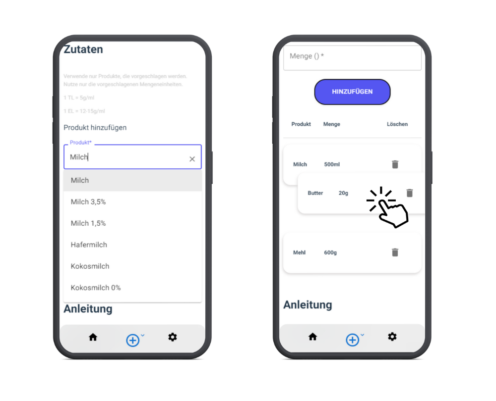

# Freshfinds - App für Einkäufe & Rezepte

## Das kann Freshfinds

- Erstelle Einkaufslisten
- Erstelle eigene Rezepte
- Erstelle anhand der Rezepte eigene Essenspläne
- Bearbeite und Teile alle Listen, Rezepte & Essenspläne

## So funktioniert's

- Gehe auf die Webseite [Freshfinds](https://freshfinds.web.app/)
- Erstelle einen neuen Account
- Fertig! Erstelle nun deine eigenen Listen, Rezepte & Essenspläne

## Tech Stack

- React + JSX + Vite
- UI: MUI component library, Google Fonts
- Hosting & Deployment: Firebase
- Database: Cloud Firestore
- Authentication: Firebase Authentication
- Illustrations: [undraw.co](https://undraw.co/)
- Logo & Mockups: [canva.com](https://www.canva.com/)

## Special Features

- Autocomplete für die Auswahl von Produkten für Rezepte
- Drag and Drop zum Bearbeiten der Listen

- Teile & Bearbeite alle Listen per Knopfdruck
- Lade eigene Bilder von deinen Rezepten hoch
- In einem Essensplan werden die Mengenangaben aller Produkte, die du für alle Rezepte brauchst, zusammengefasst, zusammengerechnet & verlinkt

## Warum Freshfinds?

Wer kennt es nicht: Man sucht Rezepte aus dem Internet raus und wird zuerst von Werbung vollgespammt.
Will man die Rezepte nochmal kochen, muss man zuerst den Link suchen und sich erneut durch die Seite wühlen.
Eigene Anpassungen oder Mengenveränderungen können selten vorgenommen werden oder man hat es bis dahin bereits vergessen.

Hat man einmal Rezepte herausgesucht, muss man diese auch noch einkaufen und eine eigene Einkaufsliste erstellen.

**Freshfinds löst alle Probleme bei der Essensplanung.** Du kannst **eigene Listen erstellen, bearbeiten und Anleitungen für Rezepte schreiben.**
Alle Listen und Rezepte können beliebig **unter Nutzern geteilt werden**, sodass alle Freshfinds-Nutzer über die Listen und Rezepte verfügen können.

Hast du eigene Rezepte erstellt, dann kannst du einen Essensplan kreieren. Ein Essensplan nimmt automatisch die Produkte aus den Rezepten.
Anhand der **Portionen wird die Gesamtmenge aller Produkte aus allen ausgewählten Rezepten berechnet**. Mit einem Knopfdruck hast du eine Liste mit allen Produkten, die du für die ausgewählten Rezepte brauchst.

### Einkaufslisten erstellen

### Rezepte erstellen

### Essenspläne erstellen

## Über Mich

Hallo und Danke, dass du bis hier unten gescrollt hast. Ich bin Max - JS/React-Entwickler.

Freshfinds ist entstanden, weil meine Freundin und ich jede Woche einen Wocheneinkauf machen. Für den Wocheneinkauf wurden natürlich auch Listen erstellt.

Immer wieder gab es Diskussionen, was wir nun essen sollen und was wir zum Einkaufen brauchen. Da mir das zu mühselig war, habe ich diese App programmiert.

Das Hauptaugenmerk in diesem Projekt liegt auf der Anbindung an Firebase, Cloud Firestore und die Verwendung von React mit JSX.

**Fun fact:** Das Logo ist angelehnt an unserer Katze "Scomber", die auch mal sehr verfressen sein kann.

